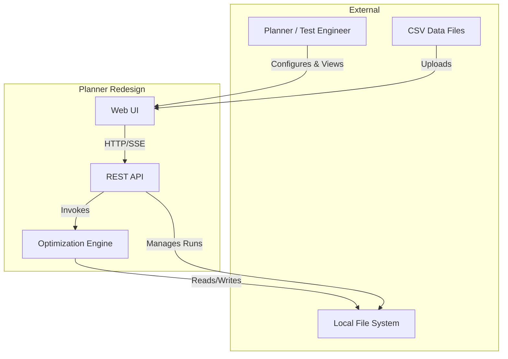
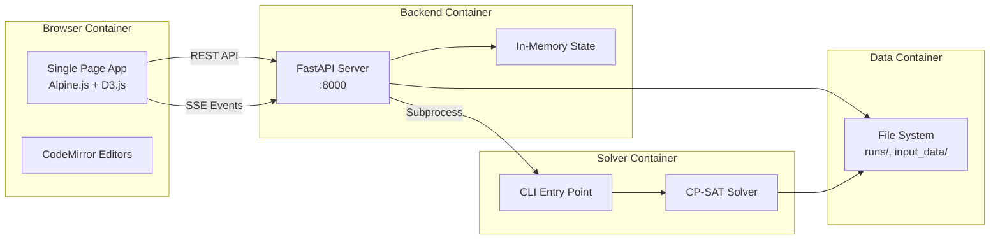
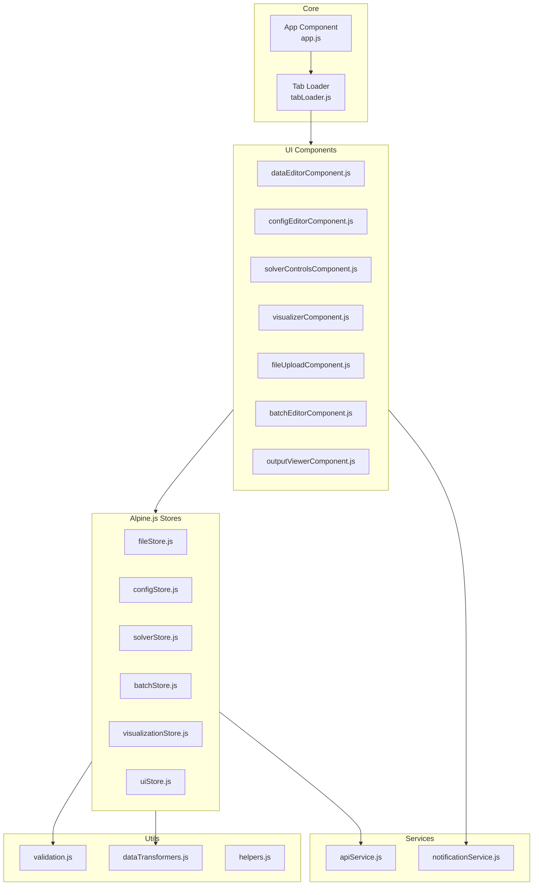
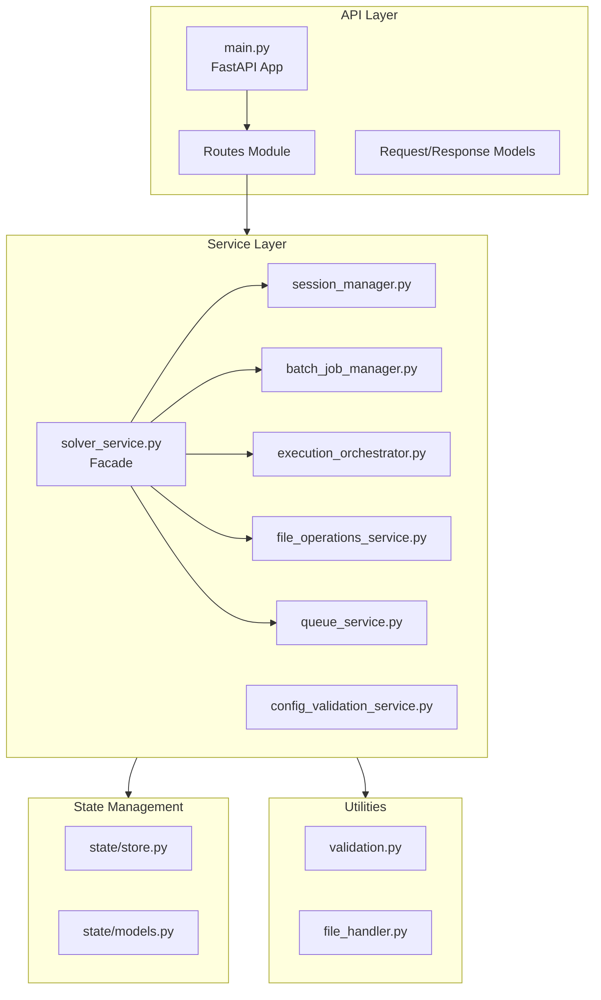
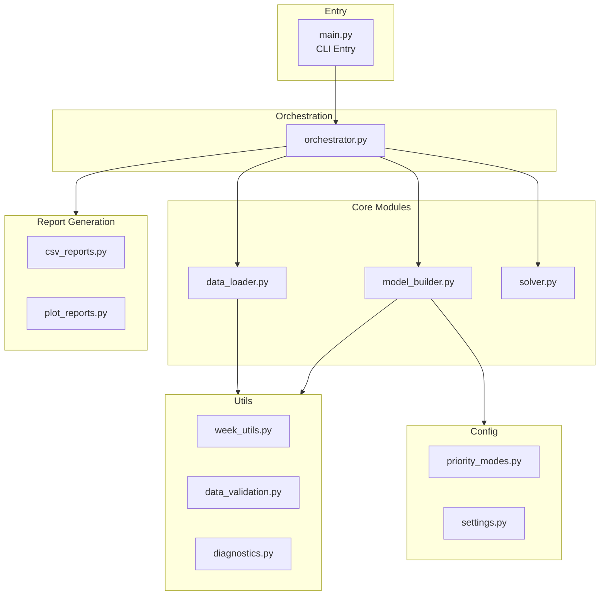

# Architecture Overview

## System Context (C4 Level 1)

The Planner Redesign system sits between end users (planners, test engineers) and the raw input data they need to schedule. It produces optimized schedules and reports.

**System Boundaries:**
- **Actors**: Planners and test engineers who need to schedule tests
- **Inputs**: CSV files containing leg definitions, test specifications, resource availability
- **Outputs**: Optimized schedules, resource utilization reports, visualization artifacts
- **External Systems**: None directly - the system is self-contained with file-based I/O

## Container Architecture (C4 Level 2)

The system consists of three main containers that can be deployed independently.

### Container Descriptions

| Container | Technology | Description |
|-----------|------------|-------------|
| **Frontend SPA** | JavaScript, Alpine.js, Vite | Browser-based UI. Served as static files. Manages application state client-side. |
| **Backend API** | FastAPI, Python 3.8+ | REST API server. Handles HTTP requests, session management, and orchestrates solver execution. |
| **Solver Engine** | OR-Tools, Python 3.8+ | Standalone optimization engine. Can run independently or be invoked by backend. |

### Communication Patterns

| From | To | Protocol | Purpose |
|------|-----|----------|---------|
| Frontend | Backend | HTTP/REST | API calls for CRUD operations |
| Frontend | Backend | SSE | Real-time solver progress updates |
| Backend | Solver | Subprocess | Execute optimization with captured stdout/stderr |
| Backend | Files | POSIX | Read/write run data, configurations |
| Solver | Files | POSIX | Read input data, write schedules/reports |

## Component Architecture (C4 Level 3)

### Frontend Components

### Backend Components

### Solver Components

## Architectural Patterns

### 1. Service Layer Pattern (Backend)

The backend implements a **service layer** that encapsulates business logic and provides a clean API boundary.

**Implementation:**
- `ServiceFactory` provides dependency injection
- Services are single-purpose and composable
- Routes delegate all logic to services

**Benefits:**
- Testable business logic (mock services)
- Clear separation of concerns
- Easy to add new features via new services

### 2. Reactive Store Pattern (Frontend)

Alpine.js stores act as **single source of truth** for application state.

**Implementation:**
- `Alpine.store()` registers global stores
- Components react to store changes via `x-effect`
- Async actions update stores incrementally

**Benefits:**
- Predictable state updates
- Component decoupling
- Easy debugging with Alpine DevTools

### 3. Orchestrator Pattern (Solver)

The solver uses an **orchestrator** to coordinate the pipeline stages.

**Implementation:**
- `run_planning_pipeline()` sequences data loading → model building → solving → reporting
- Progress callbacks enable real-time feedback
- Clean separation between stages

**Benefits:**
- Testable stages independently
- Flexible pipeline (skip stages, add stages)
- Clear error handling boundaries

### 4. Event Streaming Pattern

Real-time updates use **Server-Sent Events (SSE)** for efficient push communication.

**Implementation:**
- Backend exposes `/stream` endpoints
- Frontend uses `EventSource` API
- Events include progress, status, and result payloads

**Benefits:**
- No polling overhead
- Real-time UI updates
- Simple reconnection logic

## Key Design Decisions

### Decision 1: Monolithic Backend with Embedded Solver

**What:** The backend invokes the solver as a subprocess rather than a separate microservice.

**Rationale:**
- Simpler deployment (fewer moving parts)
- Lower latency for file access
- Easier local development

**Trade-offs:**
- **Pros**: Single deployment unit, shared file system access, simpler ops
- **Cons**: Tighter coupling, solver can't scale independently

### Decision 2: Alpine.js for Frontend Reactivity

**What:** Use Alpine.js instead of React/Vue for frontend interactivity.

**Rationale:**
- Progressive enhancement fits HTMX pattern
- Smaller bundle size
- Better SEO with server-rendered HTML

**Trade-offs:**
- **Pros**: Simple mental model, works with existing HTML, small footprint
- **Cons**: Less ecosystem than React, limited component libraries

### Decision 3: In-Memory State for Active Runs

**What:** Active run sessions are stored in-memory rather than a database.

**Rationale:**
- Runs are ephemeral (hours, not days)
- Low latency for status queries
- Simpler architecture

**Trade-offs:**
- **Pros**: Fast access, no DB overhead, simple
- **Cons**: State lost on restart, not horizontally scalable

### Decision 4: CSV as Primary Data Format

**What:** Input and output use CSV files rather than a database.

**Rationale:**
- Users can edit data in spreadsheets
- Easy version control
- Portable between systems

**Trade-offs:**
- **Pros**: User-friendly, version-controllable, portable
- **Cons**: No referential integrity, limited query capability

## Module Breakdown

### Frontend: Core Module (`core/`)

- **Purpose**: Application bootstrap, routing, and configuration
- **Key Components**: `app.js` (main component), `tabLoader.js` (lazy tab loading)
- **Dependencies**: Alpine.js, HTMX configuration

### Frontend: Stores Module (`stores/`)

- **Purpose**: Centralized application state management
- **Key Components**: `solverStore.js`, `configStore.js`, `fileStore.js`, `batchStore.js`
- **Dependencies**: Alpine.js store API, apiService

### Frontend: Services Module (`services/`)

- **Purpose**: Backend communication abstraction
- **Key Components**: `apiService.js` (REST client), `notificationService.js`
- **Dependencies**: fetch API, EventSource API

### Backend: API Module (`api/`)

- **Purpose**: HTTP request handling and response formatting
- **Key Components**: `routes/solver.py`, `routes/runs_batch.py`, `models/requests.py`
- **Dependencies**: FastAPI, Pydantic

### Backend: Services Module (`services/`)

- **Purpose**: Business logic implementation
- **Key Components**: `solver_service.py` (facade), `execution_orchestrator.py`
- **Dependencies**: State module, solver subprocess

### Backend: State Module (`state/`)

- **Purpose**: In-memory state persistence
- **Key Components**: `store.py`, `models.py`
- **Dependencies**: None (pure Python)

### Solver: Core Module (`solver/`)

- **Purpose**: Constraint programming model and solving
- **Key Components**: `model_builder.py`, `solver.py`, `data_loader.py`
- **Dependencies**: OR-Tools, pandas

### Solver: Reports Module (`reports/`)

- **Purpose**: Output generation
- **Key Components**: `csv_reports.py`, `plot_reports.py`
- **Dependencies**: pandas, matplotlib