# Workflow Overview

## Core Workflows

### Workflow 1: Data Upload and Validation

Users upload CSV data files containing leg, test, FTE, and equipment information.

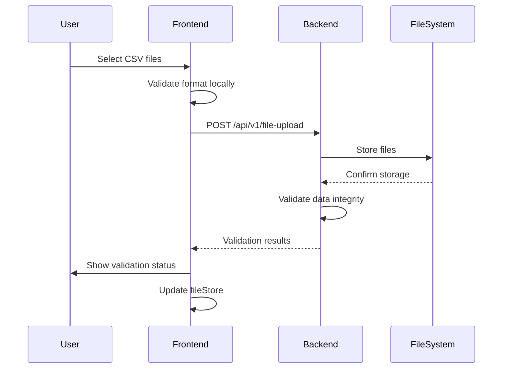

**Steps:**
1. User clicks file upload component and selects CSV files
2. Frontend performs preliminary format validation
3. Files are uploaded to backend via multipart/form-data
4. Backend stores files and validates content (column headers, data types)
5. Validation results returned to UI with any errors/warnings
6. FileStore updated with file references and validation state

### Workflow 2: Configuration Setup

Users configure priority modes, constraints, and solver parameters.

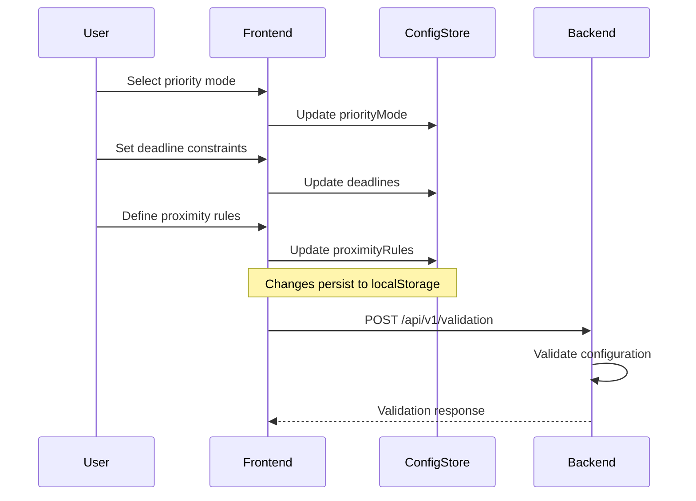

**Steps:**
1. User navigates to Configuration tab
2. Select priority mode (leg_priority, end_date_priority, etc.)
3. Add/edit deadline constraints for tests
4. Define proximity rules (tests that must run close together)
5. Set penalty settings for constraint violations
6. Frontend validates with backend API
7. Configuration persists to browser localStorage

### Workflow 3: Solver Execution (Single Scenario)

Execute the optimization solver for a single configuration.

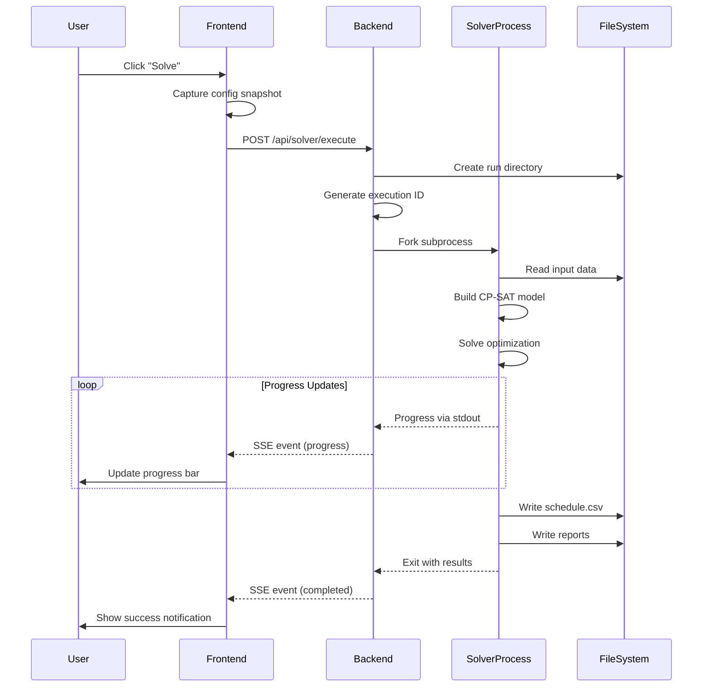

**Steps:**
1. User clicks "Solve" button in Solver Controls
2. Frontend captures current configuration and data snapshots
3. POST request to `/api/solver/execute` with configuration payload
4. Backend creates run directory with timestamp
5. Backend forks solver subprocess with configuration
6. Solver loads data, builds model, runs CP-SAT optimization
7. Progress events stream to frontend via SSE
8. On completion, solver writes schedule and reports to file system
9. Backend captures solver output and closes stream
10. Frontend shows completion and offers to view results

### Workflow 4: Batch Execution

Run multiple scenarios with different configurations in one batch.

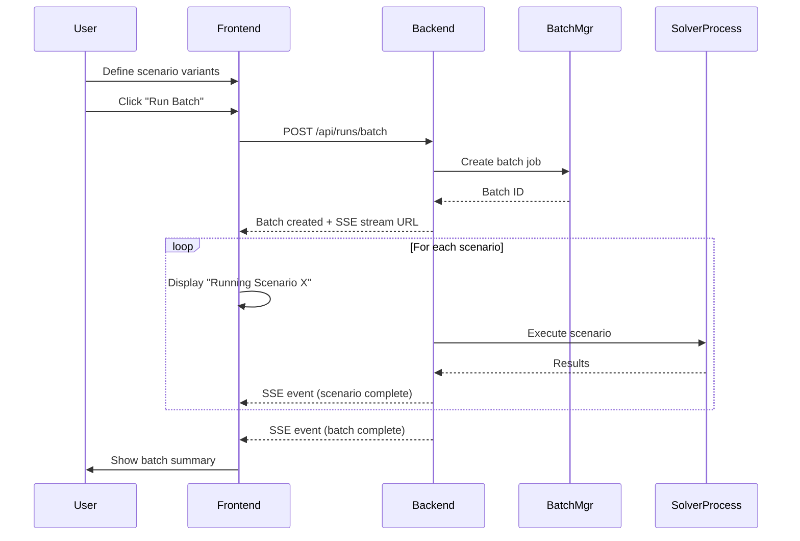

**Steps:**
1. User defines multiple scenario configurations in Batch Editor
2. Each scenario has unique config overrides
3. User initiates batch execution
4. Backend creates batch job with queue of scenarios
5. Frontend opens SSE stream for progress updates
6. Each scenario executes sequentially or in parallel
7. Progress events update individual scenario status
8. After all scenarios complete, batch summary generated
9. Results available for comparison

### Workflow 5: Results Visualization

View and analyze solver output through charts and tables.

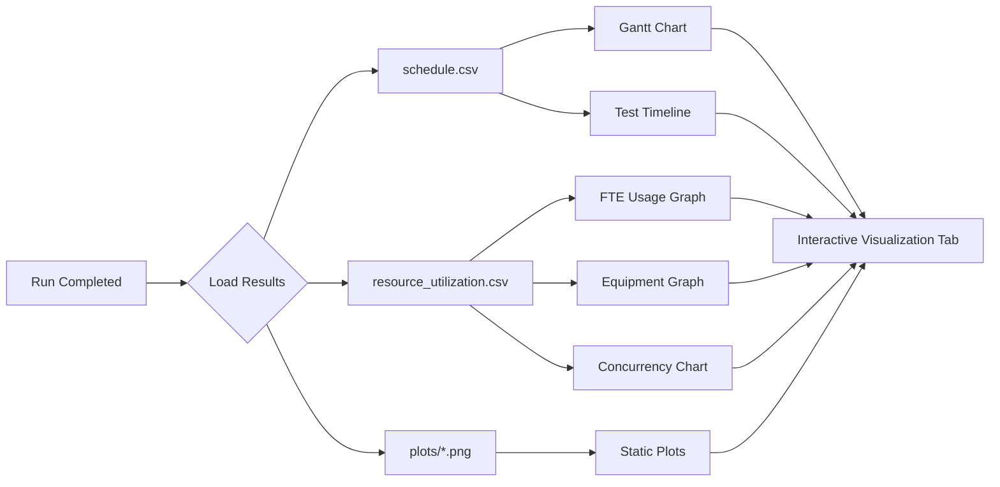

**Steps:**
1. User navigates to Visualizer tab
2. Frontend loads latest run results from file system
3. D3.js renders interactive Gantt chart
4. Resource utilization graphs show FTE/equipment usage over time
5. Concurrency chart shows parallel test execution
6. Users can filter, zoom, and export visualizations

## Data Flow

### Input Data Flow

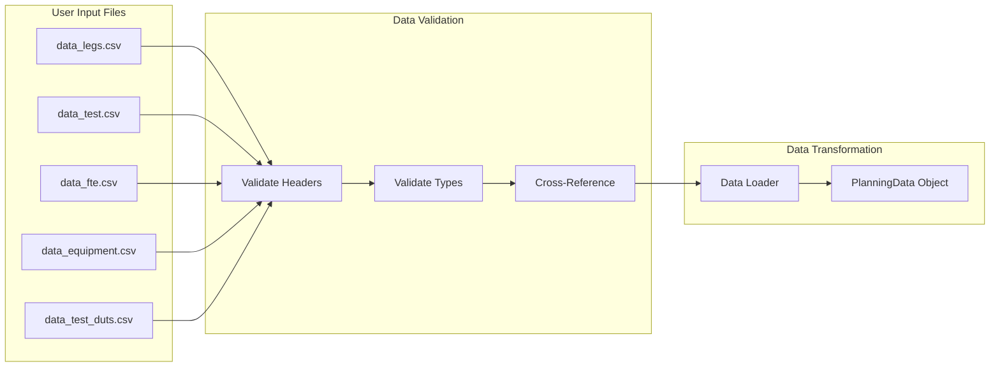

### Solver Data Flow

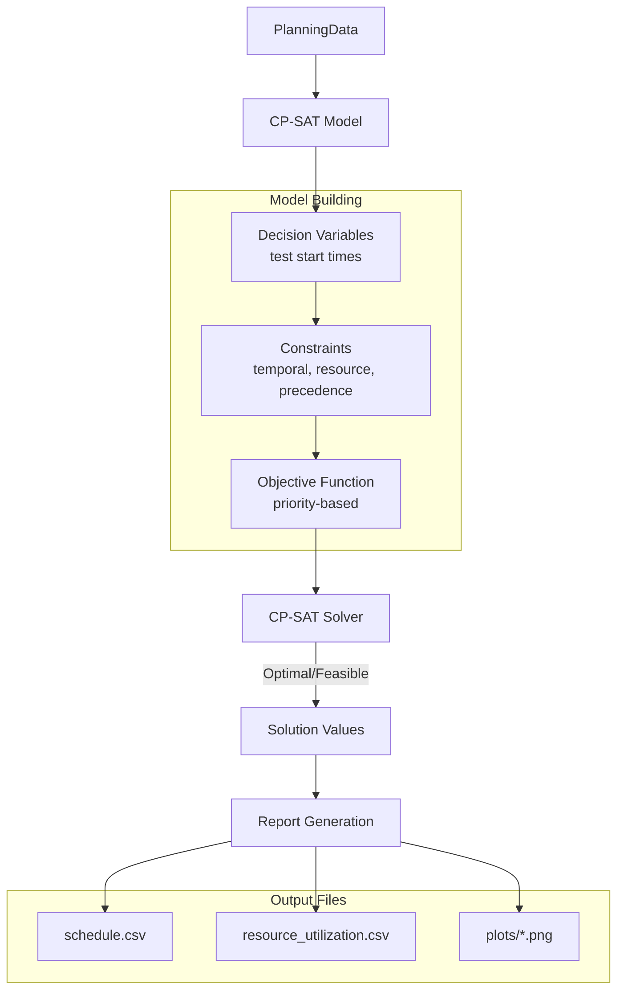

### API Data Flow

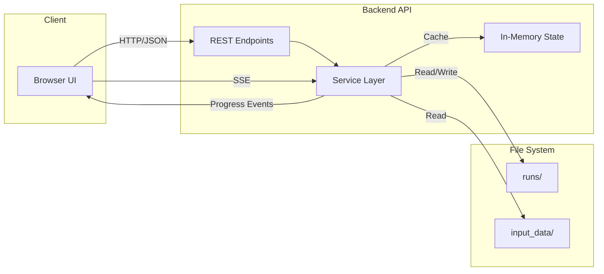

## State Management

### Frontend State (Alpine.js Stores)

| Store | Purpose | Key Properties |
|-------|---------|----------------|
| `fileStore` | Uploaded file references | `files`, `validationErrors` |
| `configStore` | Solver configuration | `priorityMode`, `deadlines`, `proximityRules`, `penaltySettings` |
| `solverStore` | Solver execution state | `status`, `executionId`, `progress`, `results` |
| `batchStore` | Batch job management | `scenarios`, `batchStatus`, `results[]` |
| `visualizationStore` | Chart state | `scheduleData`, `resourceData`, `selectedView` |
| `uiStore` | UI preferences | `activeTab`, `notifications`, `theme` |

**Persistence:**
- Critical state persisted to `localStorage`
- Session data (active runs) cleared on page close
- Configuration auto-saved on changes

### Backend State (In-Memory)

| Data Structure | Purpose | Lifecycle |
|---------------|---------|-----------|
| `ExecutionState` | Active solver executions | Created on solve, deleted on completion |
| `SessionState` | User session data | Created on first API call, TTL-based expiry |
| `BatchState` | Batch job tracking | Created on batch start, persisted to files |

**State Access Pattern:**
```python
# Service accesses state via store
state = store.get_execution(execution_id)
if state is None:
    raise NotFoundError(f"Execution {execution_id} not found")
```

### Solver State (File-Based)

| Directory | Contents | Purpose |
|-----------|----------|---------|
| `runs/{run_id}/` | Run-specific files | Isolated execution outputs |
| `runs/{run_id}/input/` | Input data snapshot | Reproducibility |
| `runs/{run_id}/output/` | Solver outputs | Results and reports |

## Error Handling

### Frontend Error Handling

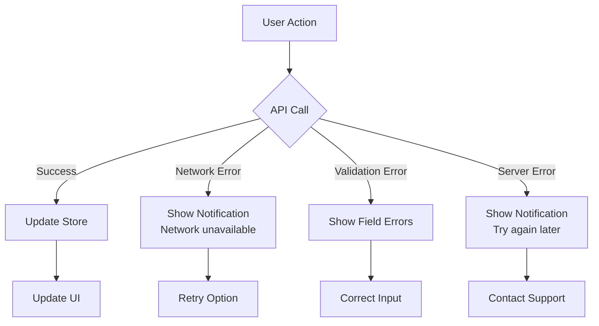

**Error Display:**
- Toast notifications for transient errors
- Inline validation for form errors
- Error boundary for component failures

### Backend Error Handling

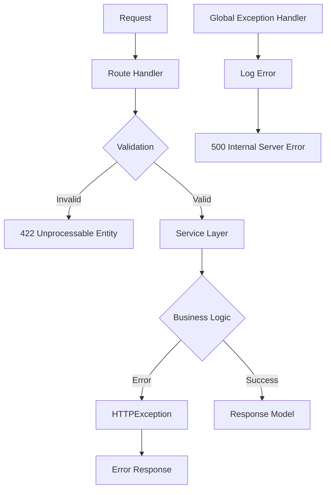

**Exception Hierarchy:**
- `HTTPException`: Client errors (4xx)
- `ServiceException`: Business logic errors
- `InternalServerError`: Unexpected failures (5xx)

### Solver Error Handling

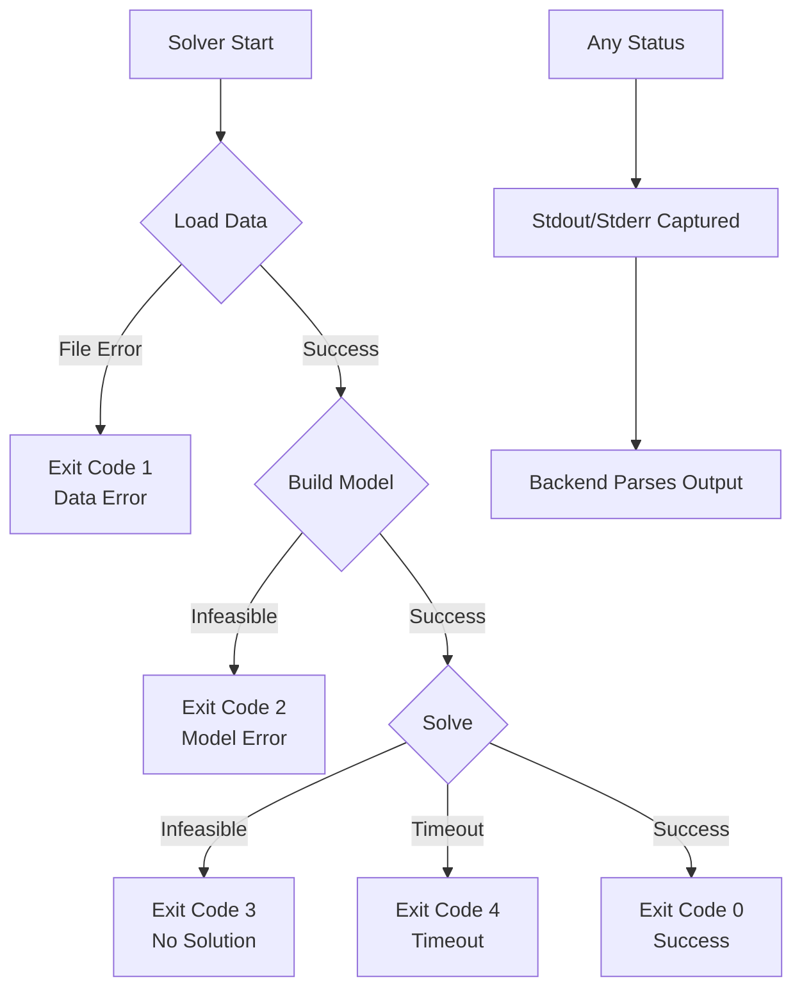

**Error Propagation:**
- Solver exit codes mapped to error states
- Stderr captured and shown to user
- Partial results saved on failure if possible