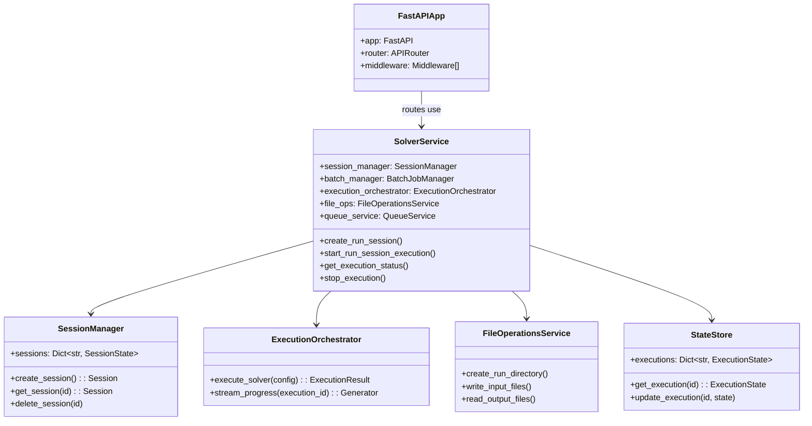

# Deep Dive: Backend Architecture

## Overview

The backend is a **FastAPI-based REST API** that serves as the orchestration layer between the frontend UI and the solver engine. It handles file management, session state, execution orchestration, and real-time progress streaming.

## Responsibilities

- Expose REST API endpoints for frontend communication
- Manage solver execution sessions and their lifecycle
- Stream real-time progress via Server-Sent Events
- Handle file upload and validation
- Coordinate batch job execution
- Persist run data to file system

## Architecture



## Directory Structure

```
backend/src/
├── api/                    # HTTP layer
│   ├── main.py             # FastAPI app initialization
│   ├── routes/             # API endpoint definitions
│   │   ├── solver.py       # Solver execution endpoints
│   │   ├── runs_batch.py   # Batch job endpoints
│   │   ├── spreadsheets.py # Spreadsheet operations
│   │   ├── file_upload.py  # File upload handling
│   │   ├── validation.py   # Configuration validation
│   │   └── health.py       # Health check endpoint
│   └── models/             # Request/Response schemas
│       ├── requests.py     # Request bodies
│       ├── responses.py    # Response bodies
│       ├── solver_responses.py
│       ├── batch_responses.py
│       └── spreadsheet_responses.py
│
├── services/               # Business logic
│   ├── solver_service.py   # Facade for solver operations
│   ├── session_manager.py  # Session lifecycle
│   ├── batch_job_manager.py # Batch job coordination
│   ├── execution_orchestrator.py # Solver subprocess
│   ├── file_operations_service.py # File I/O
│   ├── queue_service.py    # Execution queue
│   ├── config_validation_service.py # Config validation
│   ├── spreadsheet_service.py # Spreadsheet processing
│   └── file_upload_service.py # File handling
│
├── state/                  # In-memory state
│   ├── store.py            # State storage implementation
│   ├── models.py           # State data models
│   └── mappers.py          # State transformation
│
└── utils/                  # Utilities
    ├── validation.py       # Input validation
    └── file_handler.py     # File utilities
```

## Key Files

### `api/main.py`

**Purpose**: FastAPI application initialization and middleware configuration.

**Key Features:**
- CORS middleware for frontend communication
- Service factory for dependency injection
- Global exception handler
- Router registration

```python
app = FastAPI(
    title="Solver UI Integration API",
    description="Backend API for planning tool",
)

# CORS for frontend
app.add_middleware(
    CORSMiddleware,
    allow_origins=["http://localhost:3000", "http://127.0.0.1:3000"],
    allow_methods=["*"],
    allow_headers=["*"],
)

# Dependency injection
def get_service_factory():
    return ServiceFactory()

# Global exception handler
@app.exception_handler(Exception)
async def global_exception_handler(request, exc):
    logger.exception("Unhandled exception")
    return JSONResponse(
        status_code=500,
        content={"error": "Internal server error"}
    )
```

### `services/solver_service.py`

**Purpose**: Facade that coordinates all solver-related operations.

**Key Methods:**
- `create_run_session()` - Initialize a new run session
- `start_run_session_execution()` - Begin solver execution
- `get_execution_status()` - Query current execution state
- `get_execution_results()` - Retrieve solver outputs
- `stop_execution()` - Cancel running solver

```python
class SolverService:
    def __init__(
        self,
        session_manager: SessionManager,
        batch_manager: BatchJobManager,
        execution_orchestrator: ExecutionOrchestrator,
        file_ops: FileOperationsService,
        queue_service: QueueService,
        state_store: StateStore
    ):
        self.session_manager = session_manager
        self.batch_manager = batch_manager
        self.execution_orchestrator = execution_orchestrator
        self.file_ops = file_ops
        self.queue_service = queue_service
        self.state_store = state_store
    
    async def create_run_session(self, config: dict) -> str:
        session = self.session_manager.create_session()
        await self.file_ops.create_run_directory(session.id)
        await self.file_ops.write_input_files(session.id, config)
        return session.id
```

### `api/routes/solver.py`

**Purpose**: Define solver-related API endpoints.

**Key Endpoints:**
- `POST /runs` - Create a new run session
- `POST /runs/{run_id}/solve` - Start solving
- `GET /runs/{run_id}/stream` - SSE progress stream
- `POST /runs/{run_id}/stop` - Cancel execution

```python
@router.post("/execute")
async def execute_solver(
    request: SolverExecuteRequest,
    service_factory: ServiceFactory = Depends(get_service_factory)
):
    solver_service = service_factory.get_solver_service()
    execution_id = await solver_service.start_run_session_execution(
        request.config
    )
    return {"execution_id": execution_id}

@router.get("/execute/{execution_id}/stream")
async def stream_progress(execution_id: str):
    async def event_generator():
        async for event in solver_service.stream_progress(execution_id):
            yield f"data: {json.dumps(event)}\n\n"
    
    return StreamingResponse(
        event_generator(),
        media_type="text/event-stream"
    )
```

### `services/execution_orchestrator.py`

**Purpose**: Manage solver subprocess lifecycle.

**Key Features:**
- Subprocess spawning with configuration
- Stdout/stderr capture for progress parsing
- Process termination for cancellation
- Result collection on completion

```python
class ExecutionOrchestrator:
    async def execute_solver(
        self,
        config: dict,
        input_dir: Path,
        output_dir: Path
    ) -> AsyncGenerator[ProgressEvent, None]:
        # Build command
        cmd = [
            "python", "solver/main.py",
            "--input-folder", str(input_dir),
            "--output-folder", str(output_dir),
            "--priority-mode", config["priority_mode"]
        ]
        
        # Spawn process
        process = await asyncio.create_subprocess_exec(
            *cmd,
            stdout=asyncio.subprocess.PIPE,
            stderr=asyncio.subprocess.PIPE
        )
        
        # Stream output
        async for line in process.stdout:
            event = self.parse_progress_line(line)
            if event:
                yield event
        
        await process.wait()
        yield ProgressEvent(type="completed", exit_code=process.returncode)
```

### `state/store.py`

**Purpose**: In-memory state storage for active executions.

```python
class StateStore:
    def __init__(self):
        self._executions: Dict[str, ExecutionState] = {}
        self._sessions: Dict[str, SessionState] = {}
        self._lock = asyncio.Lock()
    
    async def get_execution(self, execution_id: str) -> Optional[ExecutionState]:
        async with self._lock:
            return self._executions.get(execution_id)
    
    async def update_execution(
        self, 
        execution_id: str, 
        state: ExecutionState
    ):
        async with self._lock:
            self._executions[execution_id] = state
```

## Implementation Details

### Dependency Injection Pattern

The backend uses a **factory pattern** for dependency injection:

```python
class ServiceFactory:
    def __init__(self):
        self._state_store = StateStore()
        self._file_ops = FileOperationsService()
        # ... other dependencies
    
    def get_solver_service(self) -> SolverService:
        return SolverService(
            session_manager=SessionManager(self._state_store),
            batch_manager=BatchJobManager(),
            execution_orchestrator=ExecutionOrchestrator(),
            file_ops=self._file_ops,
            queue_service=QueueService(),
            state_store=self._state_store
        )
```

**Benefits:**
- Testable services (mock factory)
- Singleton state management
- Clean dependency graph

### Server-Sent Events (SSE)

Progress streaming uses SSE for efficient push communication:

```python
@router.get("/execute/{execution_id}/stream")
async def stream_progress(execution_id: str):
    return StreamingResponse(
        event_generator(execution_id),
        media_type="text/event-stream",
        headers={
            "Cache-Control": "no-cache",
            "Connection": "keep-alive",
        }
    )

async def event_generator(execution_id: str):
    # Replay past events for reconnection
    for event in get_past_events(execution_id):
        yield f"event: {event.type}\ndata: {event.json}\n\n"
    
    # Stream new events
    async for event in solver_service.stream_progress(execution_id):
        yield f"event: {event.type}\ndata: {event.json}\n\n"
```

### Request/Response Models

All API contracts are defined with Pydantic models:

```python
# Request model
class SolverExecuteRequest(BaseModel):
    config: SolverConfig
    input_files: Optional[Dict[str, str]] = None
    
    class SolverConfig(BaseModel):
        priority_mode: str
        time_limit: Optional[int] = 300
        deadlines: List[DeadlineConfig] = []
        proximity_rules: List[ProximityRule] = []

# Response model
class ExecutionResponse(BaseModel):
    execution_id: str
    status: str
    created_at: datetime
    
class SolverProgressEvent(BaseModel):
    type: str  # "progress", "completed", "error"
    progress: Optional[float] = None
    message: Optional[str] = None
    results: Optional[SolverResults] = None
```

## Dependencies

### Internal Dependencies
- `services/` - Business logic layer
- `state/` - State management
- `utils/` - Utilities

### External Dependencies
- `fastapi` - Web framework
- `uvicorn` - ASGI server
- `pydantic` - Data validation
- `python-multipart` - File upload handling
- `pandas` - Data processing

## API Endpoints Summary

| Endpoint | Method | Purpose |
|----------|--------|---------|
| `/api/health` | GET | Health check |
| `/api/v1/file-upload` | POST | Upload data files |
| `/api/v1/validation` | POST | Validate configuration |
| `/api/solver/execute` | POST | Start solver |
| `/api/solver/execute/{id}/stream` | GET | SSE progress |
| `/api/solver/execute/{id}/stop` | POST | Cancel solver |
| `/api/solver/status/{id}` | GET | Get status |
| `/api/solver/results/{id}` | GET | Get results |
| `/api/runs` | GET | List runs |
| `/api/runs/batch` | POST | Start batch |
| `/api/spreadsheets` | POST | Process spreadsheet |

## Testing

```bash
# Run all backend tests
cd backend && python -m pytest

# Run specific test file
python -m pytest tests/test_solver_service.py

# Run with coverage
python -m pytest --cov=src
```

**Test Structure:**
```python
import pytest
from httpx import AsyncClient
from src.api.main import app

@pytest.fixture
async def client():
    async with AsyncClient(app=app, base_url="http://test") as client:
        yield client

@pytest.mark.asyncio
async def test_execute_solver(client):
    response = await client.post("/api/solver/execute", json={
        "config": {"priority_mode": "leg_priority"}
    })
    assert response.status_code == 200
    assert "execution_id" in response.json()
```

## Potential Improvements

1. **Database Backend**: Replace in-memory state with Redis/PostgreSQL
2. **Job Queue**: Use Celery for async job processing
3. **Authentication**: Add JWT-based auth for multi-user support
4. **Rate Limiting**: Protect API from abuse
5. **OpenTelemetry**: Add distributed tracing
6. **Containerization**: Dockerize for easy deployment