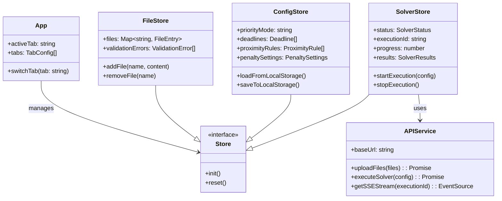

# Deep Dive: Frontend Architecture

## Overview

The frontend is a **single-page application (SPA)** built with vanilla JavaScript ES6+, Alpine.js for reactivity, and D3.js for visualization. It follows a **progressive enhancement** architecture where the base HTML is functional and JavaScript enhances interactivity.

## Responsibilities

- Provide intuitive UI for data upload and editing
- Manage solver configuration
- Execute solver runs and display progress
- Visualize results through interactive charts
- Handle batch scenario execution
- Persist user preferences locally

## Architecture



## Directory Structure

```
frontend/src/js/
├── core/                   # Application bootstrap
│   ├── app.js              # Main Alpine component
│   ├── tabLoader.js        # Lazy tab loading with HTMX
│   └── htmx-config.js      # HTMX configuration
│
├── stores/                 # Alpine.js global stores
│   ├── index.js            # Store registration
│   ├── fileStore.js        # File upload state
│   ├── configStore.js      # Solver configuration
│   ├── solverStore.js      # Execution state
│   ├── batchStore.js       # Batch job state
│   ├── visualizationStore.js  # Chart data
│   ├── validationStore.js  # Validation errors
│   ├── uiStore.js          # UI preferences
│   └── themeStore.js       # Theme management
│
├── services/               # Backend communication
│   ├── apiService.js       # REST API client
│   └── notificationService.js  # Toast notifications
│
├── components/             # Alpine.js components
│   ├── dataEditorComponent.js
│   ├── configEditorComponent.js
│   ├── solverControlsComponent.js
│   ├── visualizerComponent.js
│   ├── batchEditorComponent.js
│   ├── outputViewerComponent.js
│   ├── fileUploadComponent.js
│   └── themeToggleComponent.js
│
├── utils/                  # Utility functions
│   ├── validation.js       # Input validation
│   ├── dataTransformers.js # Data shape conversion
│   └── helpers.js          # General utilities
│
└── plot-templates/         # D3.js chart definitions
    ├── gantt-tests.js
    ├── fte.js
    ├── equipment.js
    └── concurrency.js
```

## Key Files

### `core/app.js`

**Purpose**: Main application component that manages tabs and coordinates stores.

**Key Features:**
- Tab-based navigation (data, configuration, solver, visualizer, output_data)
- HTMX-powered lazy tab loading
- Hash-based routing
- Global event listeners for error handling

```javascript
// Simplified structure
Alpine.data('app', () => ({
    activeTab: 'data',
    tabs: [
        { id: 'data', label: 'Data', icon: 'database' },
        { id: 'configuration', label: 'Configuration', icon: 'settings' },
        { id: 'solver', label: 'Solver', icon: 'play' },
        { id: 'visualizer', label: 'Visualizer', icon: 'chart' },
        { id: 'output_data', label: 'Output Data', icon: 'download' }
    ],
    init() {
        this.$nextTick(() => this.loadTab(this.activeTab));
    },
    async loadTab(tabId) {
        // HTMX loads tab content
    }
}));
```

### `stores/solverStore.js`

**Purpose**: Manages solver execution state and SSE communication.

**Key Features:**
- Scenario queue management
- EventSource for real-time progress
- Status transitions: IDLE → RUNNING → COMPLETED/FAILED
- Config/data snapshot capture

```javascript
// Key state machine
const STATUS = {
    IDLE: 'idle',
    RUNNING: 'running',
    COMPLETED: 'completed',
    FAILED: 'failed'
};

// SSE connection pattern
connectToStream(executionId) {
    const eventSource = new EventSource(
        `/api/solver/execute/${executionId}/stream`
    );
    eventSource.onmessage = (event) => {
        const data = JSON.parse(event.data);
        this.handleProgress(data);
    };
}
```

### `services/apiService.js`

**Purpose**: Centralized API communication with error handling.

**Key Features:**
- Priority config normalization (UI → backend format)
- Deadline parsing and week date conversion
- Consistent error handling

```javascript
class ApiService {
    constructor() {
        this.baseUrl = 'http://localhost:8000/api';
    }

    async executeSolver(config) {
        const normalizedConfig = this.normalizeConfig(config);
        const response = await fetch(`${this.baseUrl}/solver/execute`, {
            method: 'POST',
            headers: { 'Content-Type': 'application/json' },
            body: JSON.stringify(normalizedConfig)
        });
        return this.handleResponse(response);
    }
}
```

### `components/visualizerComponent.js`

**Purpose**: Interactive visualization of solver results.

**Key Features:**
- D3.js Gantt chart rendering
- Filter and zoom controls
- Tooltip interactions

## Implementation Details

### Tab Loading with HTMX

The application uses **HTMX** for lazy loading tab content, reducing initial bundle size.

```html
<div id="tab-content" 
     hx-get="/tabs/{activeTab}" 
     hx-trigger="load" 
     hx-swap="innerHTML">
</div>
```

**Benefits:**
- Faster initial page load
- Progressive enhancement
- Server-side template rendering

### Alpine.js Store Pattern

Stores are registered globally and accessed via `Alpine.store()`:

```javascript
// Registration (stores/index.js)
Alpine.store('solver', solverStoreDefinition);
Alpine.store('config', configStoreDefinition);

// Usage in component
this.$store.solver.startExecution(config);
```

**Reactivity:**
- `x-effect` watches store changes
- Components auto-update when store changes

### Event-Driven Communication

Components communicate via **custom events** dispatched through Alpine:

```javascript
// Dispatch event from child component
this.$dispatch('solver:started', { executionId });

// Listen in parent component
<div @solver-started.window="handleSolverStart($event.detail)">
```

**Benefits:**
- Loose coupling between components
- Easy to add new listeners
- Namespace events (e.g., `solver:started`)

## Dependencies

### Internal Dependencies
- `stores/*` - State management
- `services/*` - API communication
- `utils/*` - Validation and transformation

### External Dependencies
- `alpinejs` - Reactive framework
- `htmx.org` - AJAX/HTML interactions
- `d3` - Data visualization
- `codemirror` - Text editors
- `papaparse` - CSV parsing
- `tailwindcss` - Styling

## API Interfaces

The frontend communicates with the backend through these endpoints:

| Endpoint | Method | Purpose |
|----------|--------|---------|
| `/api/v1/file-upload` | POST | Upload data files |
| `/api/v1/validation` | POST | Validate configuration |
| `/api/solver/execute` | POST | Start solver execution |
| `/api/solver/execute/{id}/stream` | GET | SSE progress stream |
| `/api/solver/execute/{id}/stop` | POST | Cancel execution |
| `/api/runs/batch` | POST | Start batch execution |
| `/api/runs` | GET | List run history |

## Testing

### Unit Tests (`*.test.js`)

```bash
# Run all frontend tests
npm test

# Run specific test file
npm test -- solverStore.test.js
```

**Test Structure:**
```javascript
describe('solverStore', () => {
    beforeEach(() => {
        Alpine.store('solver', { ...initialState });
    });

    test('starts execution and updates status', async () => {
        const store = Alpine.store('solver');
        await store.startExecution(mockConfig);
        expect(store.status).toBe('running');
    });
});
```

### E2E Tests (Playwright)

```bash
# Run E2E tests
npm run test:e2e
```

## Potential Improvements

1. **TypeScript Migration**: Add type safety with TypeScript
2. **Component Library**: Extract reusable components to library
3. **State Persistence**: Export/import configuration as JSON files
4. **WebSocket for SSE**: More robust real-time communication
5. **Virtual Scrolling**: Handle large datasets in tables
6. **Offline Support**: Service worker for offline capability