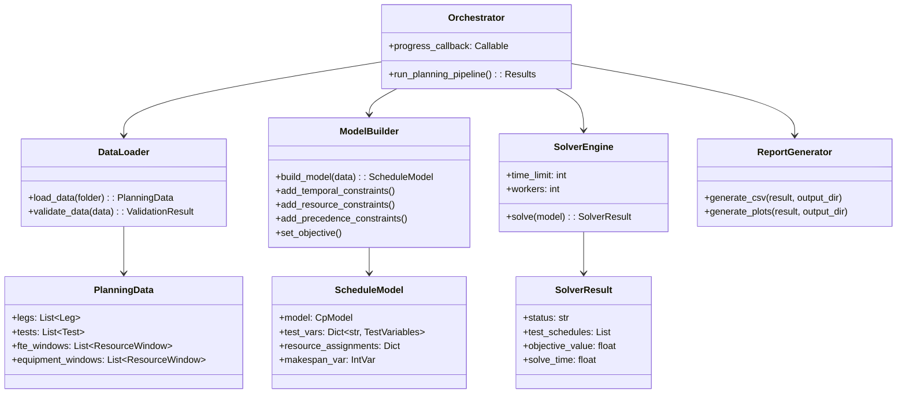

# Deep Dive: Solver Architecture

## Overview

The solver is a **constraint programming optimization engine** built on Google OR-Tools CP-SAT solver. It solves the resource-constrained project scheduling problem (RCPSP) for test execution workflows, supporting multiple priority modes and configurable constraints.

## Responsibilities

- Load and validate input data from CSV files
- Build CP-SAT constraint programming model
- Execute optimization with time limits
- Generate output reports (schedules, utilization, plots)
- Support multiple priority/objective modes
- Provide progress feedback during solving

## Architecture



## Directory Structure

```
solver/
├── main.py                 # CLI entry point
├── orchestrator.py         # Pipeline coordination
├── data_loader.py          # Data loading and validation
├── model_builder.py        # CP-SAT model construction
├── solver.py               # Solver execution wrapper
│
├── config/                 # Configuration
│   ├── __init__.py
│   ├── priority_modes.py   # Priority mode definitions
│   └── settings.py         # Solver settings
│
├── reports/                # Output generation
│   ├── __init__.py
│   ├── csv_reports.py      # CSV schedule output
│   └── plot_reports.py     # Matplotlib visualizations
│
├── utils/                  # Utilities
│   ├── __init__.py
│   ├── week_utils.py       # ISO week handling
│   ├── data_validation.py  # Input validation
│   ├── diagnostics.py      # Debug output
│   ├── profiling.py        # Performance profiling
│   ├── intervals.py        # Interval utilities
│   └── logging_config.py   # Logging setup
│
├── tests/                  # Unit tests
│   ├── test_pipeline_integration.py
│   ├── test_model_builder_components.py
│   ├── test_week_normalization.py
│   └── ...
│
└── examples/               # Usage examples
    ├── basic_usage.py
    ├── advanced_config.py
    └── custom_data.py
```

## Key Files

### `main.py`

**Purpose**: CLI entry point with argument parsing.

**Key Features:**
- Argument parsing with argparse
- Priority mode selection
- Time limit configuration
- Debug level control

```python
def main():
    parser = argparse.ArgumentParser(description="Planning Solver")
    parser.add_argument("--input-folder", required=True)
    parser.add_argument("--output-folder", default="output")
    parser.add_argument("--priority-mode", default="leg_priority")
    parser.add_argument("--time-limit", type=int, default=300)
    parser.add_argument("--debug-level", type=int, default=0)
    parser.add_argument("--priority-config", help="YAML/JSON config file")
    
    args = parser.parse_args()
    
    # Load priority config if provided
    priority_config = load_priority_config(args.priority_config)
    
    # Run pipeline
    results = run_planning_pipeline(
        input_folder=Path(args.input_folder),
        output_folder=Path(args.output_folder),
        priority_mode=args.priority_mode,
        time_limit=args.time_limit,
        debug_level=args.debug_level,
        priority_config=priority_config
    )
    
    return 0 if results.status == "optimal" else 1
```

### `orchestrator.py`

**Purpose**: Coordinate the solver pipeline stages.

**Pipeline Stages:**
1. Load data from CSV files
2. Build CP-SAT model
3. Execute solver
4. Generate reports

```python
def run_planning_pipeline(
    input_folder: Path,
    output_folder: Path,
    priority_mode: str,
    time_limit: int = 300,
    progress_callback: Callable = None
) -> PipelineResult:
    """Execute the complete planning pipeline."""
    
    # Stage 1: Load Data
    if progress_callback:
        progress_callback("loading", 0.1, "Loading input data...")
    planning_data = load_data(input_folder)
    
    # Stage 2: Build Model
    if progress_callback:
        progress_callback("modeling", 0.2, "Building CP-SAT model...")
    schedule_model = build_model(planning_data, priority_mode)
    
    # Stage 3: Solve
    if progress_callback:
        progress_callback("solving", 0.3, "Running optimization...")
    solver_result = solve_model(
        schedule_model, 
        time_limit=time_limit,
        progress_callback=progress_callback
    )
    
    # Stage 4: Generate Reports
    if progress_callback:
        progress_callback("reporting", 0.9, "Generating reports...")
    output_files = generate_reports(
        solver_result, 
        planning_data, 
        output_folder
    )
    
    if progress_callback:
        progress_callback("completed", 1.0, "Pipeline complete")
    
    return PipelineResult(
        status=solver_result.status,
        output_files=output_files,
        solve_time=solver_result.solve_time
    )
```

### `data_loader.py`

**Purpose**: Load and validate input CSV files.

**Data Classes:**

```python
@dataclass
class Leg:
    """A leg represents a collection of related tests."""
    leg_id: str
    name: str
    start_week: int  # ISO week number
    end_week: int
    tests: List[str] = field(default_factory=list)

@dataclass
class Test:
    """A single test to be scheduled."""
    test_id: str
    name: str
    duration: int  # In time units (e.g., hours or days)
    leg_id: Optional[str]
    resources: List[str] = field(default_factory=list)
    predecessors: List[str] = field(default_factory=list)
    deadline: Optional[int] = None  # Latest end time

@dataclass
class ResourceWindow:
    """Resource availability time window."""
    resource_id: str
    start: int
    end: int
    capacity: int = 1

@dataclass
class PlanningData:
    """Container for all input data."""
    legs: List[Leg]
    tests: List[Test]
    fte_windows: List[ResourceWindow]
    equipment_windows: List[ResourceWindow]
    test_duts: Dict[str, List[str]] = field(default_factory=dict)
```

**Loading Logic:**

```python
def load_data(input_folder: Path) -> PlanningData:
    """Load all input CSV files."""
    legs = load_legs(input_folder / "data_legs.csv")
    tests = load_tests(input_folder / "data_test.csv")
    fte_windows = load_resource_windows(input_folder / "data_fte.csv")
    equipment_windows = load_resource_windows(input_folder / "data_equipment.csv")
    test_duts = load_test_duts(input_folder / "data_test_duts.csv")
    
    # Cross-reference validation
    validate_references(legs, tests, fte_windows, equipment_windows)
    
    return PlanningData(
        legs=legs,
        tests=tests,
        fte_windows=fte_windows,
        equipment_windows=equipment_windows,
        test_duts=test_duts
    )
```

### `model_builder.py`

**Purpose**: Construct CP-SAT constraint model.

**Key Functions:**

```python
def build_model(
    data: PlanningData, 
    priority_mode: str,
    priority_config: dict = None
) -> ScheduleModel:
    """Build the CP-SAT scheduling model."""
    
    model = cp_model.CpModel()
    horizon = calculate_horizon(data)
    
    # Create decision variables
    test_vars = create_test_variables(model, data.tests, horizon)
    resource_assignments = create_resource_assignments(model, data)
    
    # Add constraints
    add_temporal_constraints(model, data, test_vars)
    add_resource_constraints(model, data, test_vars, resource_assignments)
    add_precedence_constraints(model, data, test_vars)
    
    # Set objective based on priority mode
    set_objective(model, test_vars, data, priority_mode, priority_config)
    
    return ScheduleModel(
        model=model,
        test_vars=test_vars,
        resource_assignments=resource_assignments,
        horizon=horizon
    )

def add_temporal_constraints(model, data, test_vars):
    """Add time-based constraints."""
    for test in data.tests:
        vars = test_vars[test.test_id]
        
        # Duration constraint: end - start = duration
        model.Add(vars.end - vars.start == test.duration)
        
        # Optional deadline constraint
        if test.deadline:
            model.Add(vars.end <= test.deadline)

def add_resource_constraints(model, data, test_vars, resource_assignments):
    """Add non-overlap constraints for resources."""
    for resource_id, assignments in resource_assignments.items():
        # Create interval variables for each test using this resource
        intervals = []
        for test_id, capacity in assignments.items():
            vars = test_vars[test_id]
            interval = model.NewIntervalVar(
                vars.start, capacity, vars.end, f"interval_{test_id}_{resource_id}"
            )
            intervals.append(interval)
        
        # Non-overlap constraint
        model.AddNoOverlap(intervals)
```

### `config/priority_modes.py`

**Purpose**: Define priority mode configurations.

**Available Modes:**

| Mode | Objective | Use Case |
|------|-----------|----------|
| `leg_priority` | Minimize weighted sum of leg completion times | Prioritize certain legs |
| `end_date_priority` | Minimize deviation from target end dates | Meet deadlines |
| `sticky_end_date` | Prefer tests near their deadlines | Stable scheduling |
| `resource_bottleneck` | Maximize resource utilization | Efficiency |
| `test_proximity` | Keep related tests close together | Reduce setup time |

```python
PRIORITY_MODES = {
    "leg_priority": {
        "objective": "minimize_sum",
        "weights": "leg_priority_weights",
        "description": "Minimize weighted leg completion times"
    },
    "end_date_priority": {
        "objective": "minimize_deviation",
        "target": "end_dates",
        "description": "Minimize deviation from target end dates"
    },
    "sticky_end_date": {
        "objective": "minimize_distance",
        "target": "deadlines",
        "description": "Schedule tests close to their deadlines"
    },
    "resource_bottleneck": {
        "objective": "maximize_utilization",
        "description": "Optimize for resource utilization"
    },
    "test_proximity": {
        "objective": "minimize_gap",
        "groups": "proximity_groups",
        "description": "Keep specified test groups close together"
    }
}
```

### `solver.py`

**Purpose**: Execute CP-SAT solver with configuration.

```python
def solve_model(
    schedule_model: ScheduleModel,
    time_limit: int = 300,
    workers: int = 8
) -> SolverResult:
    """Execute the CP-SAT solver."""
    
    solver = cp_model.CpSolver()
    
    # Configure solver
    solver.parameters.max_time_in_seconds = time_limit
    solver.parameters.num_search_workers = workers
    
    # Add solution callback for progress
    callback = SolutionProgressCallback()
    
    # Solve
    status = solver.Solve(schedule_model.model, callback)
    
    # Extract solution
    if status in (cp_model.OPTIMAL, cp_model.FEASIBLE):
        test_schedules = extract_schedules(solver, schedule_model)
        return SolverResult(
            status="optimal" if status == cp_model.OPTIMAL else "feasible",
            test_schedules=test_schedules,
            objective_value=solver.ObjectiveValue(),
            solve_time=solver.WallTime()
        )
    else:
        return SolverResult(
            status="infeasible" if status == cp_model.INFEASIBLE else "unknown",
            test_schedules=[],
            objective_value=None,
            solve_time=solver.WallTime()
        )
```

### `reports/csv_reports.py`

**Purpose**: Generate CSV output files.

**Output Files:**
- `schedule.csv` - Test start/end times, resource assignments
- `resource_utilization.csv` - Resource usage over time
- `fte_usage.csv` - FTE allocation timeline
- `equipment_usage.csv` - Equipment allocation timeline

```python
def generate_schedule_csv(
    result: SolverResult,
    data: PlanningData,
    output_path: Path
):
    """Generate schedule CSV with test timing."""
    rows = []
    for schedule in result.test_schedules:
        test = data.get_test(schedule.test_id)
        rows.append({
            "test_id": schedule.test_id,
            "test_name": test.name,
            "leg_id": test.leg_id,
            "start_time": schedule.start,
            "end_time": schedule.end,
            "duration": test.duration,
            "resources": ",".join(schedule.assigned_resources)
        })
    
    df = pd.DataFrame(rows)
    df.to_csv(output_path, index=False)
```

## Implementation Details

### CP-SAT Model Components

**Decision Variables:**
- `start[t]` - Start time of test t
- `end[t]` - End time of test t
- `assigned[t, r]` - Binary: is test t assigned to resource r?

**Constraints:**
1. **Duration**: `end[t] - start[t] = duration[t]`
2. **Precedence**: `start[t2] >= end[t1]` for all (t1 → t2)
3. **Resource non-overlap**: Tests on same resource don't overlap
4. **Deadline**: `end[t] <= deadline[t]` (soft or hard)

**Objective Variants:**
- Minimize makespan: `minimize max(end[t])`
- Minimize weighted completion: `minimize Σ w[t] * end[t]`
- Minimize deviation: `minimize Σ |end[t] - target[t]|`

### Week Handling

ISO week numbers are converted to absolute time units:

```python
def week_to_time_unit(week: int, year: int = 2024) -> int:
    """Convert ISO week to time units from reference."""
    # Monday of the ISO week
    date = iso_week_to_date(year, week)
    reference = iso_week_to_date(year, 1)  # Week 1
    return (date - reference).days * TIME_UNITS_PER_DAY
```

### Progress Callback Pattern

The solver supports progress callbacks for real-time feedback:

```python
def progress_callback(stage: str, progress: float, message: str):
    """Called at each pipeline stage."""
    print(f"[{stage}] {progress*100:.0f}% - {message}")

# Usage
results = run_planning_pipeline(
    input_folder,
    output_folder,
    progress_callback=progress_callback
)
```

## Dependencies

### Internal Dependencies
- `config/` - Priority mode definitions
- `reports/` - Output generation
- `utils/` - Week handling, validation

### External Dependencies
- `ortools` - CP-SAT solver
- `pandas` - Data manipulation
- `matplotlib` - Static plots
- `pyyaml` - Config file parsing

## Testing

```bash
# Run all solver tests
cd solver && python -m pytest

# Run specific test
python -m pytest tests/test_model_builder_components.py -v

# Run with coverage
python -m pytest --cov=. tests/
```

**Test Categories:**
- `test_pipeline_integration.py` - End-to-end pipeline tests
- `test_model_builder_components.py` - Model construction tests
- `test_week_normalization.py` - Week conversion tests
- `test_resource_assignment_lists.py` - Resource handling tests
- `test_leg_end_dates_objective.py` - Priority mode tests

## Potential Improvements

1. **Parallel Model Building**: Build sub-models in parallel
2. **Warm Start**: Use previous solutions as starting points
3. **Incremental Solving**: Add constraints iteratively
4. **Solution Pool**: Return multiple solutions for comparison
5. **GPU Acceleration**: Explore GPU-based solver alternatives
6. **Constraint Relaxation**: Automatic softening of constraints