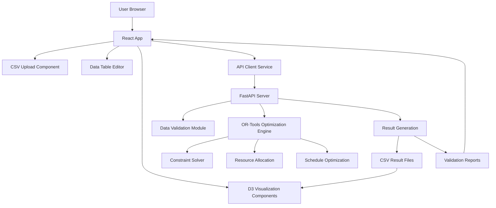

# System Architecture Documentation

## Overview

This document details the server-client architecture for the Planning Test Program optimization system.

## High-Level Architecture

### Components

1. **Web Client (Frontend)**
   - React-based single-page application
   - D3.js for interactive visualizations
   - In-browser CSV editor and table management
   - Real-time communication with backend API

2. **API Server (Backend)**
   - FastAPI RESTful web service
   - OR-Tools constraint optimization engine
   - Data validation and processing
   - Result generation and caching

3. **Data Storage**
   - In-memory data structures during optimization
   - File-based CSV storage for inputs/outputs
   - Session-based temporary storage

### Communication Flow



## Detailed Component Descriptions

### Frontend Architecture

#### React Application Structure
```
src/
├── components/
│   ├── FileUpload.jsx          # CSV file upload interface
│   ├── DataTable.jsx           # Editable data tables
│   ├── OptimizationControls.jsx # Run and configure optimization
│   ├── ResultsViewer.jsx       # Optimization results display
│   └── VisualizationTabs.jsx   # Chart navigation
├── services/
│   ├── api.js                 # HTTP client for backend API
│   ├── dataProcessor.js       # CSV parsing and formatting
│   └── validation.js          # Client-side data validation
├── utils/
│   ├── dateUtils.js           # Date manipulation helpers
│   ├── colorUtils.js          # Chart color schemes
│   └── downloadUtils.js       # File download utilities
├── visualizations/
│   ├── GanttChart.jsx         # Base Gantt chart component
│   ├── TestsGantt.jsx         # Tests by leg visualization
│   ├── EquipmentGantt.jsx     # Equipment utilization
│   ├── FTEGantt.jsx           # FTE utilization
│   └── ConcurrencyChart.jsx   # Capacity vs utilization
└── hooks/
    ├── useOptimization.js     # Optimization state management
    ├── useData.js            # Data state management
    └── useVisualization.js   # Chart state and interactions
```

#### State Management
- **React Context** for global application state
- **useState/useReducer** for component state
- **Custom hooks** for complex business logic
- **Local storage** for persistence of user preferences

### Backend Architecture

#### FastAPI Application Structure
```
server/
├── app.py                     # Main FastAPI application
├── optimization.py            # OR-Tools optimization engine
├── models.py                  # Pydantic data models
├── validation.py              # Data validation logic
├── utils/
│   ├── file_utils.py          # File handling utilities
│   ├── date_utils.py          # Date conversion helpers
│   └── logging_utils.py       # Logging configuration
├── routers/
│   ├── upload.py              # File upload endpoints
│   ├── optimize.py            # Optimization endpoints
│   ├── results.py             # Result retrieval endpoints
│   └── validate.py            # Validation endpoints
└── schemas/
    ├── input_schemas.py       # Input data schemas
    ├── output_schemas.py      # Output data schemas
    └── config_schemas.py      # Configuration schemas
```

#### OR-Tools Optimization Engine

The optimization engine implements several strategies:

1. **Makespan Minimization**: Reduce overall project duration
2. **Deadline Priority**: Meet specific test deadlines
3. **Equal Priority**: Balance resource utilization
4. **Leg-based Priority**: Prioritize specific project legs

Key optimization constraints:
- Test sequencing within legs
- Resource capacity constraints (equipment, FTE)
- Non-overlapping resource usage
- Priority-based scheduling

### Data Flow Details

#### 1. Upload Phase
```sequence
Browser->Server: POST /api/upload with CSV files
Server->Validation: Validate file structure and content
Validation-->Server: Validation results
Server->Memory: Store validated data in memory
Server-->Browser: Upload confirmation with validation report
```

#### 2. Editing Phase
```sequence
Browser->Memory: User edits data in tables
Browser->Validation: Client-side validation
Validation-->Browser: Validation feedback
Browser->Server: Optional save to temporary storage
```

#### 3. Optimization Phase
```sequence
Browser->Server: POST /api/optimize with parameters
Server->OR-Tools: Run optimization with current data
OR-Tools-->Server: Optimization results
Server->Processing: Convert results to CSV format
Server-->Browser: Optimization completion notification
```

#### 4. Results Phase
```sequence
Browser->Server: GET /api/results/{type}
Server-->Browser: CSV file download
Browser->D3: Parse and visualize results
D3-->Browser: Render interactive charts
```

### Performance Considerations

#### Frontend Performance
- **Virtual scrolling** for large data tables
- **Debounced updates** for real-time editing
- **Memoized components** to prevent unnecessary re-renders
- **Efficient D3.js updates** using data joins

#### Backend Performance
- **Async I/O** for file operations
- **Optimized OR-Tools** constraint modeling
- **Result caching** to avoid recomputation
- **Connection pooling** for database operations (if added)

#### Data Size Handling
- **Chunked processing** for very large datasets
- **Progress reporting** for long-running optimizations
- **Memory monitoring** to prevent overload

### Security Considerations

- **CORS configuration** for cross-origin requests
- **Input validation** to prevent injection attacks
- **File type verification** for uploads
- **Rate limiting** on API endpoints
- **Error handling** without exposing sensitive information

### Scalability

#### Horizontal Scaling
- **Stateless API** design for easy replication
- **Load balancing** support
- **Database separation** (if implemented)

#### Vertical Scaling
- **Optimized algorithms** for larger problem sizes
- **Memory management** for large constraint models
- **Async processing** for background optimization

### Monitoring and Logging

- **Structured logging** for all operations
- **Performance metrics** collection
- **Error tracking** and alerting
- **Usage analytics** for feature improvement

### Deployment Architecture

#### Development Environment
- **Local development** with hot reload
- **Docker containers** for consistent environments
- **Mock data** for testing

#### Production Environment
- **Containerized deployment** with Docker/Kubernetes
- **CDN** for static assets
- **Database cluster** for data persistence (if needed)
- **Monitoring stack** for observability

## Future Enhancements

### Planned Features
1. **Real-time collaboration** - Multiple users editing simultaneously
2. **Historical analysis** - Compare different optimization runs
3. **Advanced constraints** - More complex scheduling rules
4. **Machine learning** - Predictive optimization based on historical data
5. **Mobile app** - Native mobile application

### Technical Improvements
1. **WebSocket support** - Real-time updates during optimization
2. **Offline capability** - Local storage and sync
3. **Progressive Web App** - Installable web application
4. **Internationalization** - Multi-language support
5. **Accessibility** - WCAG compliance

This architecture provides a solid foundation for the Planning Test Program with room for future growth and enhancement.